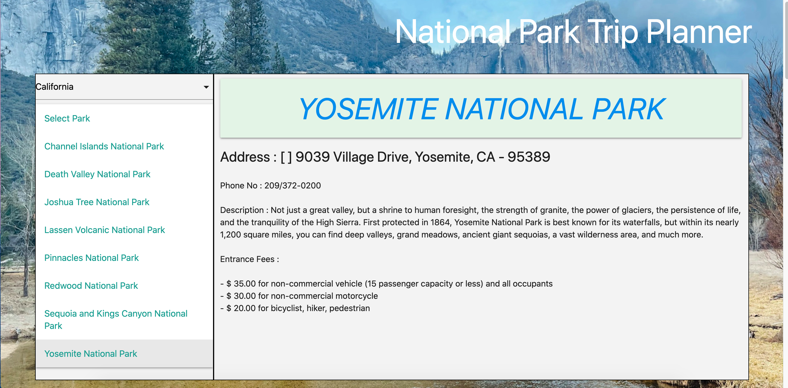

### NATIONAL PARK TRIP PLANNER

## Testing


## Purpose
National Park Trip Planner is an application that provides crucial information in regards to the most famous western National Parks for tourists and hikers. Using NPS and Open Weather API's, this application allows you to choose national parks on the west coast so hikers can plan your journey ahead.  You can see the selected Park information such as the entrance fees, address and contact. Furthermore, you can organize your hiking trip accordingly as our repository also provides the weather on that location for the next 48 hours so you can be prepared for you next adenture.

* HTML
* CSS
* Javascript
* DOM Manipulation
* JQuery
* Materialize
* Moment.js

## Open API

* OpenWeather API
* NPS API

## Website

https://miraj00.github.io/National-Park-Trip-Planner/

## Screenshots

 "Screenshot1"
 "Screenshot2"
 "Screenshot3"
 "Screenshot4"


## contribution
```
Created by Jessica Kamman, Miraj Patel, Ronnieve Romero and Walter Gonzales
```

---
##### © 2021 WG.

